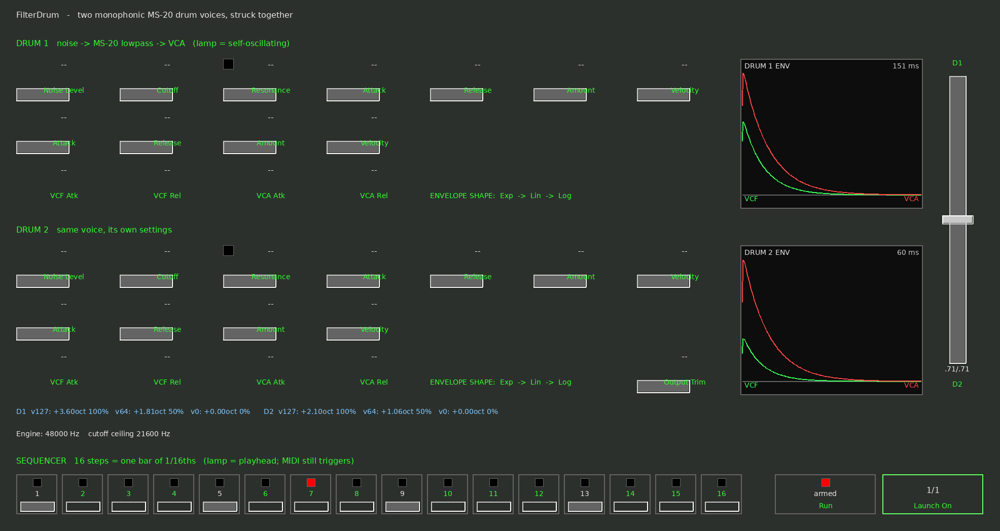
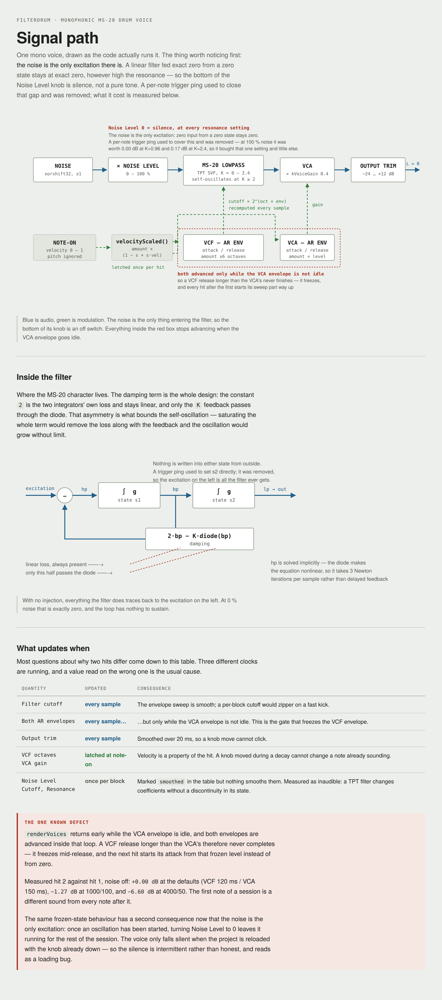

# FilterDrum

Two monophonic MS-20 drum voices, struck together.

A VST3 and Audio Unit instrument for macOS. Each voice is noise through a
Korg MS-20 lowpass into a VCA, with an AR envelope on each; the two are
blended by a constant-power crossfader. A sixteen-step sequencer rides the
host's bar lines, and MIDI still triggers it.



## What it is

* **The filter is the later, OTA (LM13600) MS-20 revision**, whose
  small-signal response is a two-pole lowpass with the damping reduced by
  the resonance feedback — self-oscillating once K ≥ 2. It is realised as a
  topology-preserving-transform state-variable filter, which exposes the
  bandpass signal, and *that* is where the diode saturator goes, because
  that is where the hardware's three back-to-back diodes sit. The resonance
  is coloured; nothing else is. The earlier Korg35 revision puts its diodes
  in the forward path and is a different sound.
* **The diodes make the feedback implicit**, so it is solved with Newton
  rather than a one-sample delay. Delayed feedback detunes the resonance at
  high cutoffs, which is what makes cheap emulations sound wrong at the top
  of the knob.
* **Noise is the only excitation.** There is no oscillator and no trigger
  ping — the filter's own ringing is the drum. The bottom of a Noise Level
  knob is therefore an off switch, not a pure-tone setting.
* **The two voices use different noise seeds**, which is what makes the
  pair a layer rather than one drum 6 dB louder.
* **The envelopes are triggered, not gated.** Note-off is ignored, because
  a drum has to sound the same whether the key was tapped or held.
* **Velocity is latched at the hit** and scales the VCF and VCA amounts,
  each with its own sensitivity control.

42 parameters, all automatable.

## The sequencer

Sixteen steps, one bar of sixteenths. Switching Run on *arms* it; it starts
on the next line the launch division fires — bar, ½, ¼, ⅛ or 1/16 — so
starting it mid-bar still lands on the grid. The transport's own clock does
the timing; the sequencer has none of its own.

Both MIDI notes and sequencer steps carry a sample offset and are sorted
together before anything is rendered, so a sixteenth is not quantised to the
block size. Sequenced hits fire at full velocity, so the Velocity
sensitivity controls respond to MIDI only.

## Signal path



`docs/signal-path.html` is the source of that picture and
`tools/make-signal-path.py` regenerates it. `docs/README.md` has the render
command.

## Building

macOS, Xcode command-line tools, CMake.

```sh
./setup-xcode.sh
```

The first configure clones the VST3 SDK (~250 MB) into `external/`, so it
takes a few minutes; later ones reuse it. `./setup-xcode.sh --help` lists
the options — `--no-au`, `--no-validator`, `--makefiles`, `--clean`.

The products are a `.vst3` bundle and a `.component` Audio Unit
(`aumu FDrm AECo`). Deployment target is macOS 10.13.

### The tests do not need the SDK

The DSP, the sequencer and the transport clock are deliberately free of
Steinberg headers, so they compile and run on their own:

```sh
g++ -std=c++17 -O2 -Isource -o dsptests tests/DspTests.cpp source/FilterDrumDsp.cpp && ./dsptests
```

321 checks on the DSP, 57 on the sequencer, plus the transport suite. They
assert measured behaviour — filter slope, self-oscillation threshold,
velocity law, level headroom — rather than just running the code.

`tools/render-panel.py` draws `docs/panel.png` from the layout constants in
the editor source, so the picture above cannot quietly drift from the panel
it depicts; it fails rather than draws a stale one if a constant is renamed.

## Known defect

`DrumVoice::render` returns early while the VCA envelope is idle, and both
envelopes advance inside the loop it returns from. A VCF release longer than
the VCA's therefore freezes mid-release instead of completing, and the next
hit starts from that frozen level. Measured at 0.4 dB — an inconsistency
with no upside rather than something anybody would hear.
`PORTING-NOTES.md` has the measurements.

## The other documents

| File | What it is |
|---|---|
| `PORTING-NOTES.md` | engineering notes — the decisions, the traps, what was measured and what was not |
| `PORT-CHECKLIST.md` | the working checklist this port was built against |
| `PORTING-GUIDE.md` | how to port a Cakewalk DXi to VST3 generally |
| `PORTING-TEMPLATE.md` | the build template's own README |

## Licence

MIT — see [LICENSE](LICENSE).

The SDKs it builds against are permissive too: the VST3 SDK 3.8.1 is MIT,
VSTGUI 4 is BSD-style and Apple's AudioUnitSDK is Apache 2.0. "VST" is a
trademark of Steinberg Media Technologies GmbH; its usage guidelines ship
with the SDK.
